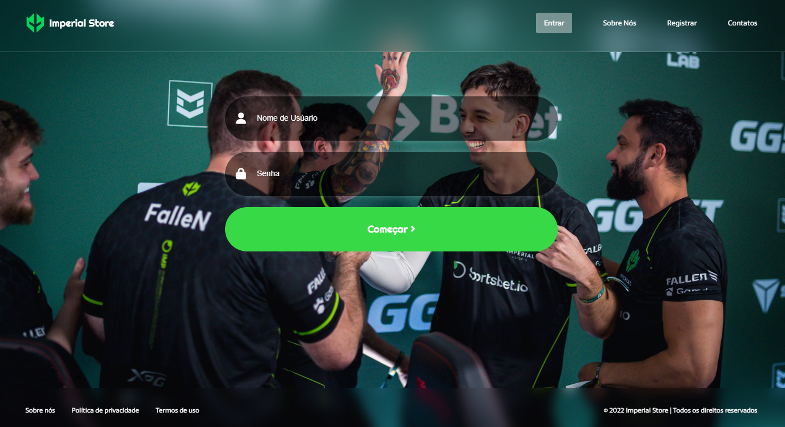
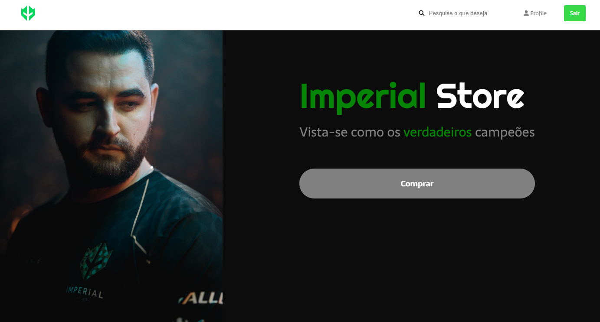

<h1 align="center">
    
</h1>

# 💻 Estartando Devs:
O Estartando Devs é um projeto social e tem como objetivo transformar o mundo através da educação e tecnologia.
[Estartando Devs](https://www.estartandodevs.com.br/)


## 📜 Sobre
Desenvolver um projeto responsivo utilizando apenas HTML e CSS

---

## 🚀 Tecnologias:
* HTML
* CSS
* Git e Github

---

## 🧾 Resultado:
Página de login:


Página principal:


## 👥 Clone o projeto:
```bash
    # Digite o seguinte comando no bash:
    $ git clone https://github.com/pablokaua/pagina-login-imperial.git
```